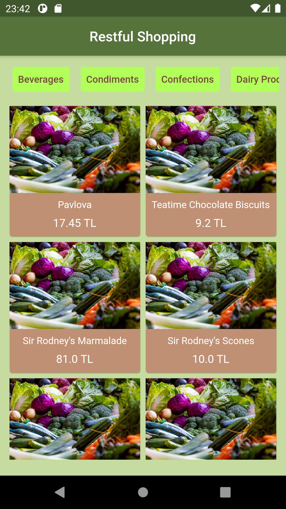

# Restful Shopping

An app that fetches data from API.

## Through this project, I have learned how to:

- create json-server.
- fetch data from API.
- parse Json data.
- create API Client Models.

Screenshot from the app:

